# ZipImagesFunction


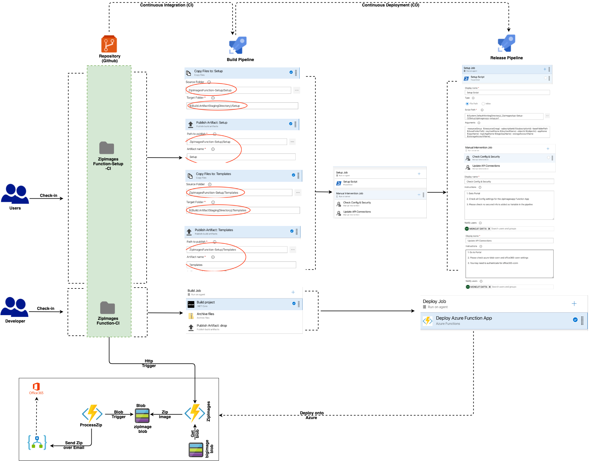

The purpose of this document is to provide an idea on how to implement an automated Approval process workflow using Azure Function, Logic Apps and then how to finally automate the setup and deployment of the entire application and its ancillary services. Logic App having many well-defined integrations with enterprise systems is always natural choice for  redundant, time consuming workloads like Sending Emails etc.

The project folder structure is divided into 2 sections -

- Application Code - Containing the source code of the entire flow
- Deployment or Setup - This is IaaC or Infrastructure as Code to setup the entire process - end to end

Let us delve into each one of these one by one

## ZipImagesFunction

### Http Trigger

```c#
[FunctionName("ZipImagesFunction")]
public static async Task Run([HttpTrigger(AuthorizationLevel.Anonymous, "post",
                            Route = "zip")]HttpRequestMessage request, ILogger log)
{

    var contentString = await request.Content.ReadAsStringAsync();
    var imageNamesList = JsonConvert.DeserializeObject<List<string>>(contentString);

    using (var ms = new MemoryStream())
    {
        using (var zp = new ZipArchive(ms, ZipArchiveMode.Create, true))
        {
            foreach (var imageNameString in imageNamesList)
            {
                var bts = await DownloadImageFromBlobAsync(imageNameString);
                var ze = zp.CreateEntry(imageNameString);
                using (var es = ze.Open())
                {
                    using (var bw = new BinaryWriter(es))
                    {
                        bw.Write(bts);
                    }
                }
            }
        }
        await UploadImageToBlobAsync(ms.ToArray());
    }
}
```

This function acts on some Http POST request to receive set of image(s) and the perform Zip operation on them using *System.IO.Compression* of .Net. And finally uploads the zipped image to a another Blob storage - *zipimageblob*

### Blob Trigger

```c#
[FunctionName("ProcessZipBlob")]
public static async Task Run([BlobTrigger("zipimageblob/{name}")]
                              CloudBlockBlob cloudBlockBlob,
                              [Blob("zipimageblob/{name}", FileAccess.ReadWrite)]
                              byte[] blobContents, ILogger log)            
{
    log.LogInformation($"{cloudBlockBlob.Name}");

    var cl = new HttpClient();
    var zm = new ZipModel()
    {

        Zip = cloudBlockBlob.Name

    };

    var zipWorkflowURL = Environment.GetEnvironmentVariable("ZIP_WORKFLOW_URL");
    var zms = JsonConvert.SerializeObject(zm);
    var contnet = new StringContent(zms, Encoding.UTF8, "application/json");
    var response = await cl.PostAsync(zipWorkflowURL, contnet);
    log.LogDebug(response.Content.ToString());

}
```

Blob trigger function which gets blob content as *byte[]* as input binding. Function then calls an Http triggered Logic App passing appropriate value for *ZIP_WORKFLOW_URL*. We would see shortly how to get that value using KeyVault task of ADO

### tmp.local.settings.json

```JSON
{
    "IsEncrypted": false,
    "Values": {
        "AzureWebJobsStorage": "<storage_account_key>",
        "FUNCTIONS_WORKER_RUNTIME": "dotnet",
        "BIG_IMAGE_BLOB_NAME": "<BIG_IMAGE_BLOB_NAME>",
        "ZIP_IMAGE_BLOB_NAME": "<ZIP_IMAGE_BLOB_NAME>",
        "ZIP_IMAGE_PREFIX": "<ZIP_IMAGE_PREFIX>",
        "ZIP_WORKFLOW_URL": "<ZIP_WORKFLOW_URL>"

    }
}
```

This is to ensure that whoever checks out this code should know what value they need to add in Application settings in the portal. The original file *local.settings.json* **<u>should NOT be checked-in</u>** and kept in the local folder

Shortly we would see how some of these values which are secured will be kept in KeyVault and referred by Azure DevOps during *Deployment* process - that way ADO becomes single source-of-truth for KeyVault taking away all complexities of KeyVault APIs and management

## ZipImagesFunction-Setup

This folder contains files for setting up the entire infrastructure for this use case using *PowerShell* and *ARM templates*. Later on we would connect this with Azure DevOps (ADO) and bring in maximum automation.

As before lst us see the folder structure and then subsequent details:

### Templates		

#### keyvault-deploy.json

ARM template for creating/updating KeyVault which would be used for storing Secured Keys used by the 				Function app as explained above - primarily the keys which are mentioned in the *local.settings.json* file

#### keyvault-deploy.ps1

PowerShell script to execute the above ARM template

#### zipimagesapp-deploy.json

ARM template for creating/updating Function App and related resources.

Function should be in ***Consumption Plan (Y)*** as the use case would have sporadic image uploads rather than continuous usage (*in which case we should have gone for **Premium Plan - EP***)

#### zipimagesapp-deploy.ps1

PowerShell script to execute the above ARM template

*Note: Script code for all the above are self-explanatory and hence not included here*

### Setup

#### zipimagesapp-setup.ps1

PowerShell script for managing the entire setup process:

```powershell
param([Parameter(Mandatory=$false)] [string] $resourceGroup = "<resource_group>",
      [Parameter(Mandatory=$false)] [string] $subscriptionId = "<subscription_id>",
      [Parameter(Mandatory=$false)] [string] $baseFolderPath = "<folder_path>",
      [Parameter(Mandatory=$false)] [string] $keyVaultname = "<keyvault_name>",
      [Parameter(Mandatory=$false)] [string] $objectId = "<object_Id>",
      [Parameter(Mandatory=$false)] [string] $appName = "<app_Name>",
      [Parameter(Mandatory=$false)] [string] $logicAppName = "<logicApp_Name>",
      [Parameter(Mandatory=$false)] [string] $storageAccountName = "<storageAccount_Name>")

$templatesFolderPath = $baseFolderPath + "/Templates"
$keyvaultDeployCommand = "/keyvault-deploy.ps1 -rg $resourceGroup -fpath $templatesFolderPath -keyVaultName $keyVaultName -objectId $objectId"
$logicAppDeployCommand = "/processzip-logicapp-deploy.ps1 -rg $resourceGroup -fpath $templatesFolderPath -logicAppName $logicAppName -storageAccountName $storageAccountName"
$functionDeployCommand = "/zipimagesapp-deploy.ps1 -rg $resourceGroup -fpath $templatesFolderPath -appName $appName -storageAccountName $storageAccountName"

# # PS Logout
# Disconnect-AzAccount

# # PS Login
# Connect-AzAccount

# PS Select Subscriotion 
Select-AzSubscription -SubscriptionId $subscriptionId

#  KeyVault deploy
$keyvaultDeployPath = $templatesFolderPath + $keyvaultDeployCommand
Invoke-Expression -Command $keyvaultDeployPath

#  Logic App deploy
$logicAppDeployPath = $templatesFolderPath + $logicAppDeployCommand
$logicAppOutput = Invoke-Expression -Command $logicAppDeployPath
Write-Host $logicAppURL

# Get EventHub Values
$outputValues = $logicAppOutput[1].Outputs.Values

foreach ($item in $outputKeys)
{
      $keysList.Add($item)
}

$index = 0;
foreach ($item in $outputValues)
{
      
      $logicAppURLKey = $keysList[$index]
      $logicAppURL = $item.Value

      $logicAppURLObject = ConvertTo-SecureString `
      -String $logicAppURL -AsPlainText -Force

      Set-AzKeyVaultSecret -VaultName $keyVaultName -Name $logicAppURLKey `
      -SecretValue $logicAppURLObject

      ++$index
}

# Clean up KeysList
$keysList.Clear();

#  Function deploy
$logicAppURLCommand = " -logicAppURL '" + $logicAppURL + "'"
$functionDeployPath = $templatesFolderPath + $functionDeployCommand + $logicAppURLCommand

Invoke-Expression -Command $functionDeployPath
```

## Integration with DevOps

### Users

Primariy two sets of users - 

* **DevOps Admin** - Can access only the ***ZipImagesFunction-Setup*** folder; so can setup the environment
* **Developer** - Can access only the ***ZipImagesFunction*** folder i.e. Application folder; can only deploy application code. ***No access to or knowledge of*** the setup process of entire infrastructure

### CI Pipelines

#### ZipImagesFunction-Setup

##### Copy Files: Setup

​	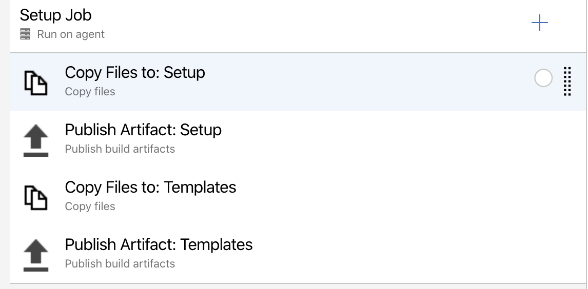

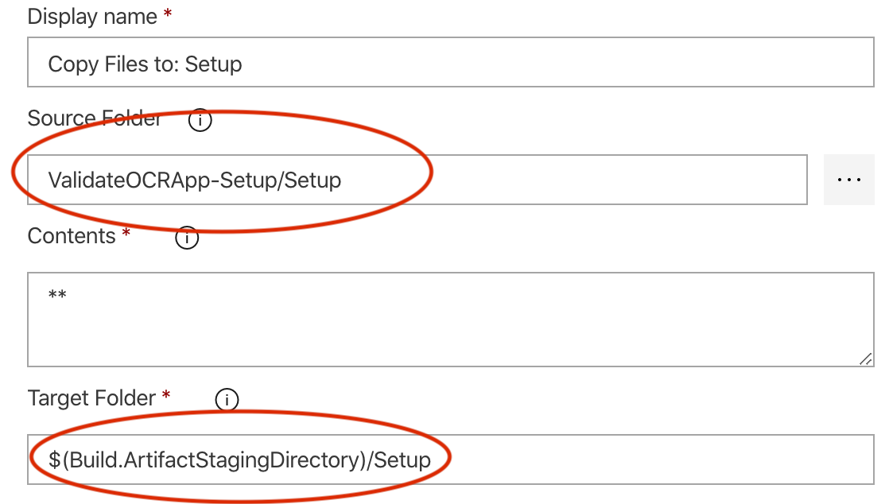


##### Publish Artifact: Setup

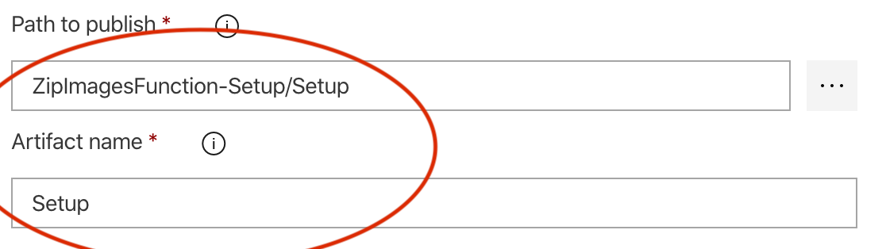	

As you can see, the Publish location of the Build artifact is **Setup** folder in this case...so all PowerShell script and JSON templates will be copied and published in the said folder. *CD* pipeline would pickup the artifact from the **Setup** folder and act accordingly

##### Copy Files: Templates

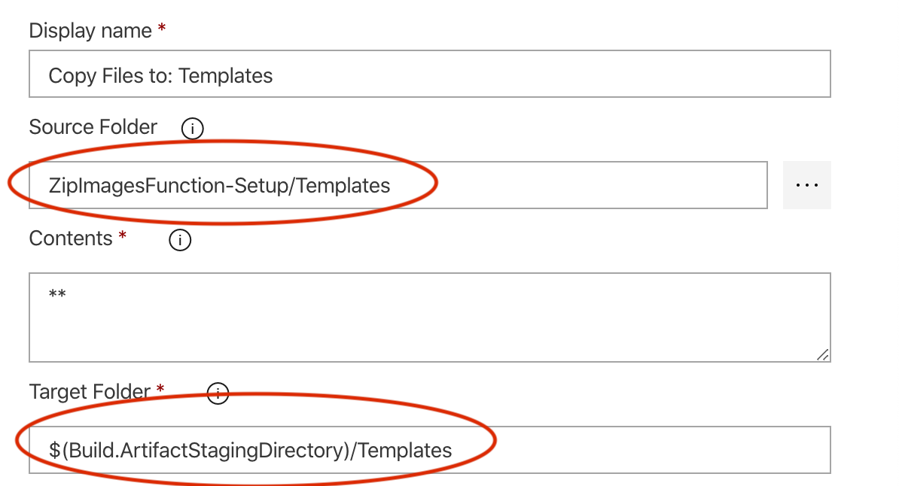


##### Publish Artifact: Templates

​	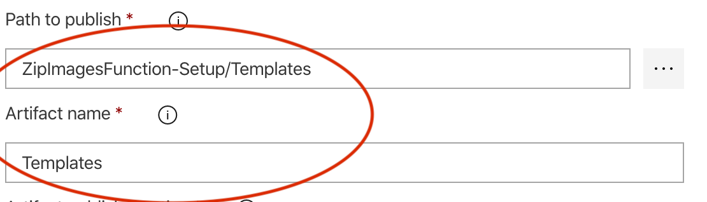

As you can see, the Publish location of the Build artifact is **Templates** folder in this case...so all PowerShell script and JSON templates will be copied and published in the said folder. *CD* pipeline would pickup the artifact from the **Templates** folder and act accordingly

##### Trigger

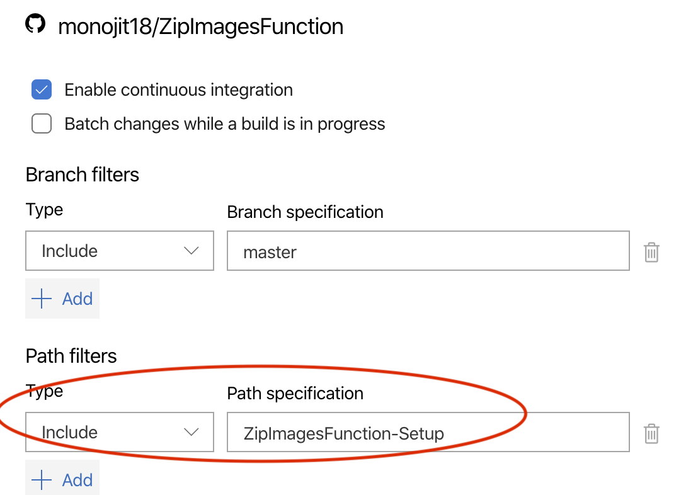

Please look at the *Path filters* section - *ValidateOCRApp-Setup* is the folder name; any changes in this folder only will trigger this *Setup* pipeline. So, both application developers and DevOps admin can peacefully work on their respective flows with minimal impact on each other!


#### ZipImagesFunction

#### 	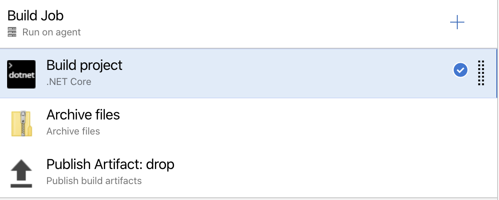	

​	As mentioned earlier, only Developers should have access to it which would build the Application code (*i.e. Durable function etc., in this case*)

##### Trigger

​			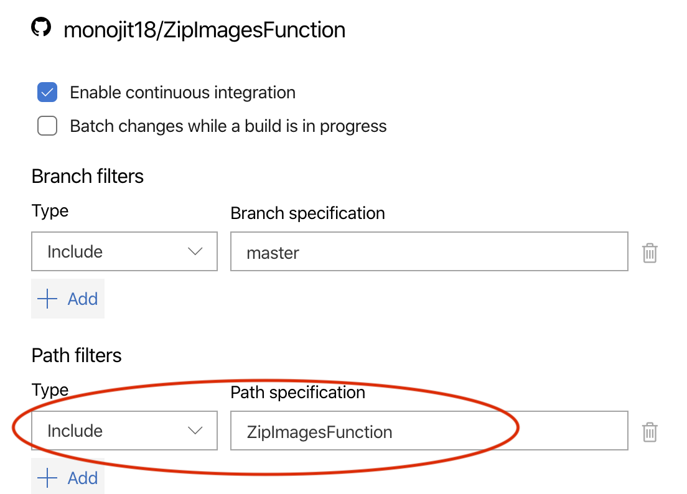	

Please look at the *Path filters* section - *ValidateOCRApp* is the folder name; any changes in this folder only will trigger this *Application Deployment* pipeline. So, both application developers and DevOps admin can peacefully work on their respective flows with minimal impact on each other!

​		

### CD Pipelines

#### ZipImagesFunction-Setup


​			

### Manual Intervention

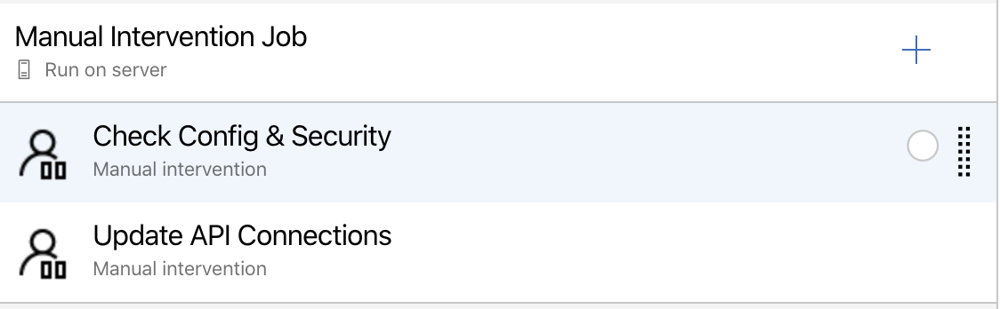

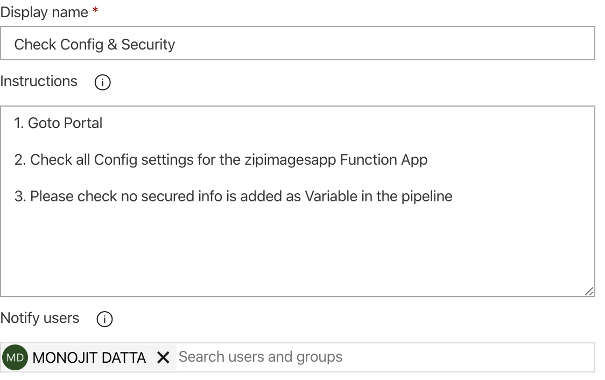

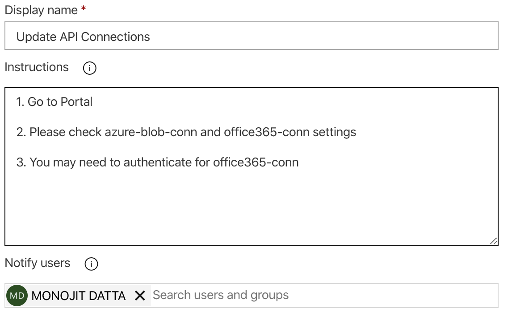

This is an important task...as I always mention that 100% automation is NOT always possible.

There are and there will be scenarios which need some Manual intervention or other for meeting some lager goal; e.g. like in this case, the job of the DevOps admin who is running this Setup CD pipeline, is to check and add the OCR API key into the KeyVault - so he has to go the portal and get the API ket from respective resource(s) and then add into the KeyVault.

Application deployment steps in ADO can actually read from KeyVault and proceed seamlessly.

As you can see, *Notify users* section actually can notify multiple folks to perform this Manual Intervention task. ADO will Pause execution of the pipeline at this stage and will wait for a Manual Resume/Reject decision by the designated person (*one of DevOps Admin group or can be someone else from the Team as decided by DevOps admin*)

​		

#### ZipImagesFunction

#### 			

This is the Application Deployment step and only one task - *Deploy Azure Function App*

=================================X======================================